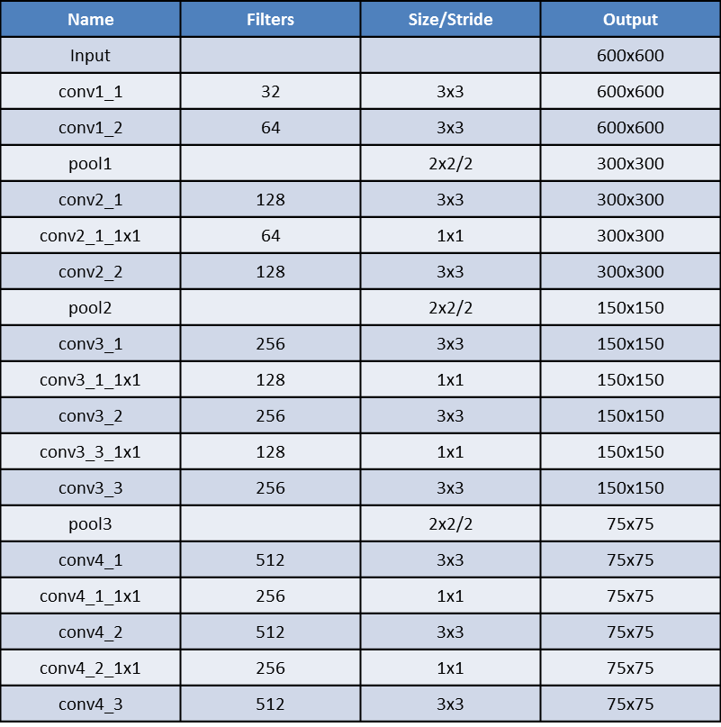
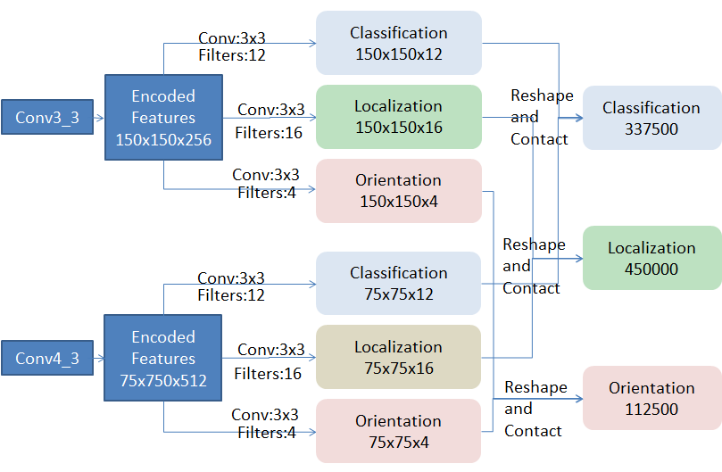
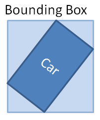
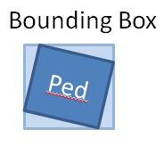

## Abstract
In the round 2 challenge, I using the neural network to process the lidar information to get the obstacle position and pose information. First, the lidar information is projected into a 2d bird's-eye view. Second, use the method similar to SSD to get the target category, bounding box and orientation, and calculate the size of the target (length, width, height) according to the bounding box size and orientation. Then, the detected target is tracked by a Kalman filter.
## 1.Introduction
In this challenge, the end result for the car needs to get 3D bounding box and 2D orientation, for pedestrian, just get 3D bounding box. After investigating a lot of methods, I decided to project the 3d point cloud information into 2D images, and then use the neural network to processing the 2D image. In this way, I can get 2D bounding box and orientation, by directly obtain another dimension of information from the point cloud, I can get the final result. 

To generate the tacklet file, I identify the same object between adjacent frames based on spatial location information and use the Kalman filter to track them. For the car object, I use unscented kalman filter. For pedestrian, I use kalman filter.

In round1, I also use radar information and lidar information. But in round2, I found that radar can only be measured to the rear or body side of the car, cannot get accurate vehicle location information, and also cannot measure the size of the vehicle. In other words, radar provides a lot of useful information, but it is not what tracklet file needed. I can’t fusion the radar and lidar sensor very well. So, I found that the after fusion the radar information, the score will be lower. It brought a lot of FP while increasing TP. But I think it will be useful in real world. So I still implemented in my code.
## 2.Method
### 2.1 Lidar Information to 2D Image
I project the 3D lidar point cloud to the bird’s eye view. As the velodyne lidar point cloud has the information of space location(x, y, z value), intensity and ring number. My bird’s eye view representation is encoded by height, intensity and ring number. Just like this paper(MV3D), I discretize the projected point cloud into a 2D grid with resolution of 0.1 m. For each cell, the height feature is computed as the maximum height of the points in the cell. The intensity value is the maximum reflectance value of the point in each cell. The ring number feature is the value of the point which has the maximum ring number in each cell. In fact, I had intended to use many additional features such as the density feature and the height slice feature. But when converting my feature maps to tfrecord files, I found I don’t have enough hard disk space. In the consideration of the density of 32e_points cloud of velodyne, after tried many range, I use the points 30 meters in each side. So my feature map has a size of 600x600 pixels.

In round 2 challenge, the intensity value in the point cloud is very important to me. The intensity value in car’s bag and the intensity value in pedestrian’s bag are completely different. In car’s bag, the average intensity value is very low. But in pedestrian’s bag, the average intensity is very high. So, in pedestrian’s bag, the car has a high intensity. In car’s bag, the car has a low intensity. I use this feature to distinguish between car in car’s bag and car in pedestrian’s bag. Because we do not have the ground truth location and orientation of cars in pedestrian's bag. This feature makes me very convenient to training the model. 
### 2.2 Network Architecture
I use convolutional neural network to detect the location of obstacles in the feature image. The network architecture, similar to SSD, has base net and multi-task layers. The base net is similar to darknet in YOLOv2. And in my multi-task layers, I calculate predicting category scores, box offsets and orientations.

Figure1: Base Net

As is shown in Figure 1, my base net is very similar to YOLOv2. I add batch normalization on all of the convolutional layers in the model. Batch normalization leads to significant improvements in convergence while eliminating the need for other forms of regularization [6]. Batch normalization also helps regularize the model [7].

In my lidar feature map, we don't have the multi-scale problems. A bird's-eye view shows the true size of the objects in the physical world. The obstacles in lidar feature map has some space priori, such as length of a car is 4-6 meters, the width of the a car is 1.5-2.5 meters. So the size of a car in my lidar feature map is 40-60 pixels length and 15-25 pixels length. And it is impossible that one car is 20x50 pixels and another car is 200x500 pixels. According to the above situation，we should not need the multi-scale feature layers in original SSD. As the target object is car and pedestrian, the only thing I need to do is find a suitable encoded feature maps and corresponding anchor boxes size and aspect ratios. 

Figure2: Multi-task Layers

According to common sense, the pedestrian has a size around (0.4-0.8)x(0.4-0.8) meters, the car has a size around (1.5-2)x(4-6) meters. I choose Conv3_3 layer and Conv4_3 layer as encoded features. Then I set up four anchor boxes (or default boxes in the original) for each point. And here, actually we can do the dimension clusters in YOLOv2 to achieve a better anchor boxes (I don’t do that). Same as SSD, I use the small kernel (3x3) to produces either a score for a category, or a shape offset relative to the anchor box coordinate. When calculating the orientation, I used the same method as the localization. Since we do not need to predict pedestrian’s orientation, so only in car’s anchor orientation is calculated. The length, width of the car object can be calculated by bounding box and orientation. But there is a problem; the distribution of the orientation value in training set is not balanced. Most of the values are distributed between –pi/2 and pi/2. So I can’t fit the orientation value very well. In fact, the rz in tracklet file I used is the yaw value in unscented kalman filter, it perform a little better than the direct regression value of model.

Because of the network don't need those large multi-scale layers, we can aslo have a large input size and achieve real time performance. This method can achieve the x and y bounding box of the obstacle in real world. The z bounding box can be found by searching the points in the bounding box.
### 2.3 Radar Information Fusion
In this part, I will give a brief describe of how I use the radar information. As is mentioned earlier, using radar information will lead a lower score. And in the program we can easily choose whether use radar or not.
It's hardly to distinguish the class of obstacles only from radar information. So not only using radar information, I use RGB image information additionally to distinguish the obstacle’s class. 
In the bag file, topics which has Radar information including '/radar/range', '/radar/tracks' and '/radar/points'. And '/radar/tracks' has much useful information; it can generate another point cloud which has the obstacles location in front of the capture car. By using calibration bag, we can get the translation vector and rotation matrix between velodyne point cloud and raw image. So I can transform radar point cloud coordinate to velodyne lidar coordinate, and then project 3D point cloud points to 2D RGB image points. Then, I use a SSD model to find the bounding box of obstacles. Next, for obstacle bounding box, we can find which 2D point in it. So, we can get the physical location of the obstacles. But there are some problems, this method cannot get the x, y bounding box in real world, and the z coordinate of radar points is always 0. Towards the first round situation, I just set the center of the car by x and y radar coordinate subtract the half length and width in metadata, and set z coordinate a constant value.
In my implementation, if the RGB process node is not running, radar information will not be fused. If the RGB process node is running, radar information will be fused automatically.
### 2.4 Kalman Filter Tracking 
In fact, I use the Kalman Filter mainly for sensor fusion, just like the udacity self-driving car course. And, even if without sensor fusion, Kalman Filter can still tracking object. 

I use the unscented Kalman Filter to track cars. The advantage of unscented Kalman is that we can estimate the vehicle movement direction. But when doing sensor fusion, I found it is hard to get the center location of the vehicle, because the radar always gets the point at the back of the vehicle or on the side of the vehicle. And, I can’t get the car size from radar information as well. So, in this challenge evaluation, it brought a lot of FP while increasing TP. Maybe, I have some error in my code; anyhow, my sensor fusion cannot increase the score. But it can help me resolve the problem of distant targets detection. 

I use standard Kalman Filter to track pedestrians. In fact, I tried both standard Kalman Filter and unscented Kalman Filter. The difference between the two methods is very small. The standard Kalman is a little faster than unscented Kalman, so I use standard Kalman Filter.

## 3 Implementation Details
### 3.1 Pipeline
The pythonnode1.py is used to process '/raw/image' message. The covnet model will calculate the location of obstacles in the image and publish the boundingbox message, which is defined in ./msg/BoundingBox.msg. If this node is running, the program will fuse radar and lidar information to detect the obstacles. In round 2 evaluation, please don’t run this node.

The pythonnode2.py is used to process '/pointcloud/featureMap' message, which is published by c_node. Same to pythonnode1.py, a covnet is used to calculate the category , location and orientation of obstacles in lidar feature map.

The main pipeline is in c_node. This node has two publisher and four subscribers. The first subscriber is used to process the velodyne lidar point cloud to feature map. And the only one publisher is used to publish the lidar feature map to pythonnode2. Two subscribers are used to process bounding box from lidar feature map and RGB image. Another subscriber is used to receive the radar information. In this node, there is an ObsStatus object, which is defined in ./include/obsstatus.hpp. ObsStatus object is used to record the information of each obstacle. The bounding box information and radar information are transmitted to ObsStatus object. In ObsStatus class, there are three queue to store radar information, image bounding box information and lidar bounding box information, and a list to store Obstacle object. The Obstacle object is used to store the information of each detected obstacle. It has unscented kalman filter and extend kalman filter(in fact is a standard kalman filter) in it to tracking different object. When a lidar bounding box is received, ObsStatus class will traversal the list and find this bounding box belonged to which obstacle. If no obstacle is found, I add a new obstacle and append it to the list. When an image bounding box is received, ObsStatus will found the latest radar point cloud and project it to 3D to find which point is inside the bounding box. If no points are found, ignore this image bounding box. If a point is found, do the same process as lidar bounding box received. The last publisher is used to publish the PoseArray massage, which contains current obstacles information. As there is no officially PoseArray massage, I defined a massage call MyPoseArray which is located in ./msg/MyPoseArray.msg. After every frame of lidar point is processed, a MyPoseArray massage will be sent.
### 3.2 Calibration
I referenced many calibration methods, and found it difficult to write an auto calibration pipeline. According to 5, the velodyne lidar only have 32 rings, the points cloud have a very low density in z dimension. So it is difficult to get the 3D coordinate of every cross corner points. In order to get a robust result, the chess board should be obliqued enough. I find one frame of the calibration bag (timestamp = 1492642061958477906). Then I cropped the chess board points out and estimate the 3D cross corner coordinate. Next, I use opencv calculate 2D coordinate of chess board corner in RGB image. Finally, I can calculate the translation vector and rotation matrix between velodyne point cloud and raw image. The code is located in ./src/calibration.

In round 2, there is something different from the round 1. The camera internal parameters and external parameters are all changed. So, I write a parameters adjusting program to get available parameters for round 2.
### 3.3 Model Training 
For the Lidar feature map convnet, I generate data from training set in round 2. As is mentioned above, I use height, intensity and ring value. By using the officially bag_to_kiiti.py, we can get location and orientation of obstacle on every camera frame. By simply change the camera timestamp index to lidar timestamp index, we can get the location and orientation on lidar frame.

Figure 3. Bounding Box Calculation

As is shown in the figure above, the bounding box is calculated in this way. The code is located in ./src/datagenerator.py. And it can generate a pickle file which has ground truth information.

The model training code is in ModifySSD, which is modified from [balancap/SSD-Tensorflow](https://github.com/balancap/SSD-Tensorflow) and [tensorflow/models](https://github.com/tensoflow/models/tree/master/slim).

In my preprocessing, I use data augmentation to with data normalize, random crops and horizontal flip. I started training with a learning rate 0.001, 0.95 decay factor and mini batch size is 4, more specific settings can be found in code. I trained about 20,000 global steps with a negative ratio 3. In our training data, every frame has only one positive sample. So, in order to reduce the false positive, I fine tuning the model with a negative ratio of 1000 and 0.0001 learning rate for about 1000 global steps.
The training process is not very stable, which means the last model not always perform better than previous. But I always can get a score beyond 0.35 from the last several models. 
### 3.4 Real Time Performance
My computer is i5 and gtx1080, and I can achieve real time performance. The average time of my pipeline to process a lidar point cloud frame is about 70ms.
### 3.6 Car Obstacle Size Calculation
As is mentioned in part 2, I use bounding box size and orientation to calculate the car size; So, I can get the obstacle car size every single frame. But in tracklet file, to one obstacle, we need one size. In my solution, I use some prior knowledge to calculate a confidence to each size. Prior knowledge include space prior, when the obstacle car is too far or too close to capture car, the size has low confidence; orientation prior, orientation close to +pi/4 or –pi/4 the size has a low confidence, this is because when orientation is pi/4, the equation has infinity solutions; car size prior, car size always within a reasonable range. 
### 3.5 Tracklet Generation
My ros node cannot output tracklet file directly. I don’t know how the udacity official to evaluate my result. I give my method here. 

My solution will out put a txt file, which can be found in obsstatus.hpp line 154 (~/lidar.txt). When publishing MyPoseArray msg, I also write the same data to this txt file.  It recorded obstacle ID, timestamp, x, y, z location, yaw (UKF state), orientation, length, width and height, at every detected timestamp. 

Then, I use the same way as bag_to_kitti.py, using the interpolate_to_camera function and camera timestamp index to calculate treacklet file.
The code is ./src/tracklets/txt_to_tracklet.py, which referenced from udacity's bag_to_kitti.py. And the .csv file in ./src/tracklets/cameraIndex is the cap_cmera.csv which is generated by bag_to_kitti.py.
If the official would like to use my method, you can change the line 154 in obsstatus.hpp to you txt file location. Then, run c_node and repaly one bag, the output will be recorded. Next, you can set the input file to your txt file, set your output dir and run txt_to_tracklet.py to generate tracklet files. After generate one tracklet file, RESTART c_node and replay another bag. If you don’t restart c_node, the node will contain obstacle information of previous bag and it would affect new obstacle detection.
Please notice that run velodyne driver when replaying ped_test.bag and DON’T runit when replaying car’s bag.

## Result
There is an example of my car detection.

1. Obstacle is found by camera and radar information, and start tracking.

2. Obstacle came into lidar range, we can calculate obstacle width and length and tracking with more accuracy information.

3. Still tracking.

4. Tracking with lidar information.

5. Still tracking with lidar information.

Here are some pedestrian detection examples.

## References
[1]. Multi-View 3D Object Detection Network for Autonomous Driving. Xiaozhi Chen, Huimin Ma, Ji Wan, Bo Li, Tian Xia International Conference on Computer Vision and Pattern Recognition (CVPR), 2017 

[2]. SSD: Single Shot MultiBox Detector. Wei Liu, Dragomir Anguelov, Dumitru Erhan, Christian Szegedy, Scott Reed, Cheng-Yang Fu, Alexander C. Berg ECCV 2016

[3]. https://github.com/balancap/SSD-Tensorflow

[4]. Emerging Topics in Computer Vision. Edited by G erard Medioni and Sing Bing Kang

[5]. Calibration of RGB Camera With Velodyne LiDAR. Martin Velas, Michal Spanel, Zdenek Materna, Adam Herout

[6]. S. Ioffe and C. Szegedy. Batch normalization: Accelerating deep network training by reducing internal covariate shift. arXiv preprint arXiv:1502.03167, 2015.

[7]. YOLO9000: Better, Faster, Stronger Joseph Redmon∗y, Ali Farhadi∗y University of Washington∗, Allen Institute for Aiy

